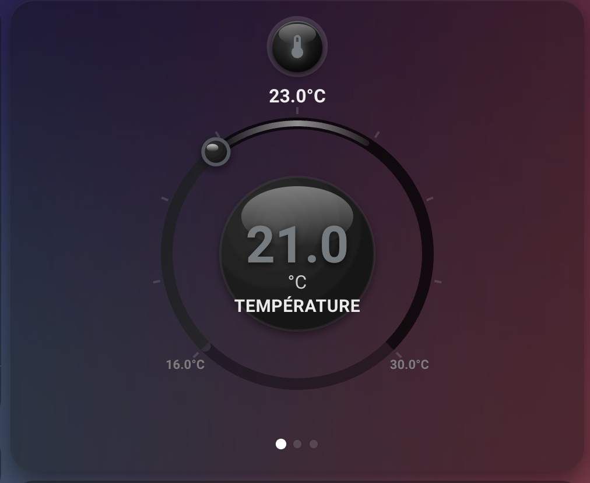

# Clickable Climate Dial Card

Une carte Lovelace pour Home Assistant : une molette circulaire unique et
tactile pour piloter un thermostat (`climate.*`), avec un rendu glossy/dark
sur mesure (anneau lumineux, badge d'icône animé, dégradés de couleur selon
le mode).



## Fonctionnalités

- Une seule molette rotative, cliquable au centre pour cycler entre 3 écrans :
  **Température**, **Vitesse de ventilation**, **Mode**.
- Glisser sur l'anneau pour ajuster la valeur en direct.
- Badge d'icône animé (pulse en chauffe/froid, rotation proportionnelle à la
  vitesse du ventilateur).
- Taper sur l'icône pendant que le climatiseur est éteint le rallume
  (raccourci "power on").
- Rester appuyé sur l'icône l'éteint.
- Retour automatique à l'écran Température après 5s d'inactivité.
- Couleurs et dégradés qui suivent le mode actif (chaud = rouge/orange,
  froid = bleu, ventilation = vert, déshumidification = violet).

## Installation

### Via HACS (recommandé)

1. HACS → Frontend → menu (⋮) → Dépôts personnalisés
2. Ajouter `https://github.com/Croustipate/clickable-climate-dial-card`,
   catégorie **Plugin**
3. Installer, puis ajouter la ressource si HACS ne le fait pas automatiquement
   (Paramètres → Tableaux de bord → Ressources)

### Manuelle

1. Copier `clickable-climate-dial-card.js` dans `/config/www/`
2. Ajouter la ressource dans Paramètres → Tableaux de bord → Ressources :
   - URL : `/local/clickable-climate-dial-card.js`
   - Type : Module JavaScript

## Configuration

```yaml
type: custom:climatisation-molette-card
entity: climate.salon
```

`entity` est obligatoire et doit être une entité du domaine `climate.`.

## Limites connues

- Le mode ventilation (`fan_mode`) est traité comme une valeur numérique de
  1 à 5 (adapté au clim de l'auteur). Si votre appareil expose des
  `fan_mode` textuels (`low`/`medium`/`high`...) ou une autre plage, cette
  fonction ne s'affichera pas correctement — contributions bienvenues.
- La liste des modes HVAC affichés (`off`, `dry`, `fan_only`, `cool`,
  `heat`, `heat_cool`) est fixe plutôt que lue dynamiquement depuis
  `hvac_modes` de l'entité.
- Pas d'éditeur visuel (l'entité se configure en YAML uniquement).

## Licence

MIT
